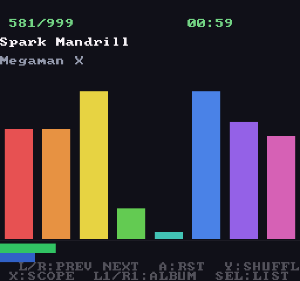

# SPC Pocket Player

Play SNES / Super Famicom **`.spc`** music files on the **Analogue Pocket** —
on a real hardware implementation of the S-SMP (SPC700) + S-DSP, not a
software emulator. The SPC700 actually runs the game's music driver and the
S-DSP renders the voices at the original 32 kHz.



Drop in a single `.spc` and it plays. For a real jukebox — album browsing,
track names, auto-advance, shuffle — bundle your songs into a **`.spcpak`**
(see below); it's the recommended way to use the core.

## Quick start

1. Grab the [latest release](https://github.com/carlosbravoa/spc-pocket-player/releases)
   and unzip it onto your SD card root (or build it yourself — see below).
2. Put your `.spc` / `.spcpak` files in `/Assets/spc/common/`.
3. Launch **SPC Player**, pick a file.

You can pick a different file from the menu any time while it's running.

## Song packs (recommended)

A raw `.spc` is a single song with no track list — it just loops forever.
A `.spcpak` bundles many songs, keeps their names and lengths, and unlocks
auto-advance, shuffle, and the track/album browser.

```sh
# one album from a folder of .spc files
python3 tools/make_spcpak.py ~/spc/chrono-trigger/ -o "Chrono Trigger.spcpak"

# your whole collection into ONE file — one album per subfolder
./tools/pack_all.sh ~/spc /media/sd/Assets/spc/common --library
```

With a library pack you pick it once and never touch the file browser again:
L1/R1 jump albums, **Select** opens a scrollable album list.

## Controls

| Button | Action |
|---|---|
| D-pad ◀ / ▶ | previous / next track |
| A | restart track |
| Y | shuffle on/off |
| X | scope: whole pack ↔ current album |
| L1 / R1 | previous / next album |
| Select | album browser (d-pad scroll, ◀▶ scroll long names, A to jump) |

Shuffle applies within the current scope. Auto-advance uses each song's
length tag with a 2-second fade-out (and any song silent for 4 s also
advances). Untagged songs loop.

## On screen

Full-screen 512×480: track counter, song + game title, 8 per-voice envelope
bars, stereo VU meters, and elapsed / total time. A colored corner square
signals status while stopped (red = pick a file, orange = loading,
magenta = read error).

## Notes & limitations

- Extended ID666 (xid6) tags are ignored; lengths come from the standard
  header tags, or `--default-length` at pack time.
- DSP audio is sample-and-held from 32 kHz to the Pocket's 48 kHz I2S (same
  as the SNES core).
- Notes already sounding at dump time restart from the sample start — a
  limitation of the `.spc` format shared by all SPC players.
- Packs made before the index/length features still play, as one album
  without auto-advance.
- Mid-session file changes work only because the data slot's `parameters` is
  `0x09` (no bit 8) — see
  [`docs/mid-session-reload-investigation.md`](docs/mid-session-reload-investigation.md)
  for that rabbit hole.

## Building & simulation

Needs Quartus Prime (Lite) with Cyclone V support.

```sh
./build.sh   # compile → bit-reverse RBF → assemble the SD tree in out/
```

The APU + loader simulate under GHDL (no license needed) — a testbench
streams a real `.spc` through the same loader the Pocket uses and dumps the
32 kHz audio to a WAV:

```sh
python3 tools/make_test_spc.py sim/test_tone.spc   # deterministic 1 kHz tone
./sim/run_sim.sh test_tone.spc 100                 # render 100 ms of audio
python3 tools/raw_to_wav.py sim/work/audio_out.raw
```

<details>
<summary>How it works</summary>

The SNES APU (`SMP.vhd` + `DSP.vhd` + `SPC700/`, from the MiSTer SNES core)
is wrapped in `spc_apu.vhd` with a 64 KB BRAM audio-RAM and a loader FSM. The
`.spc` file arrives over the APF bridge; the loader writes the ARAM image,
routes the header's SPC700 registers and the DSP registers through the MiSTer
"SPC mode" IO port, replays the `$F0–$FF` page, then releases the APU. Audio
comes out at 32 kHz and is resampled to 48 kHz I2S. Packs are read one song
at a time on demand from a `deferload` slot via `target_dataslot_read`.

</details>

## Licenses

- SNES APU RTL (`src/fpga/core/spc/`): GPL-2.0+ (srg320, MiSTer project)
- `data_loader.sv`, `sound_i2s.sv`, `sync_fifo.sv`: MIT (Adam Gastineau)
- APF framework (`src/fpga/apf/`): Analogue core template
- Everything else here: GPL-3.0
